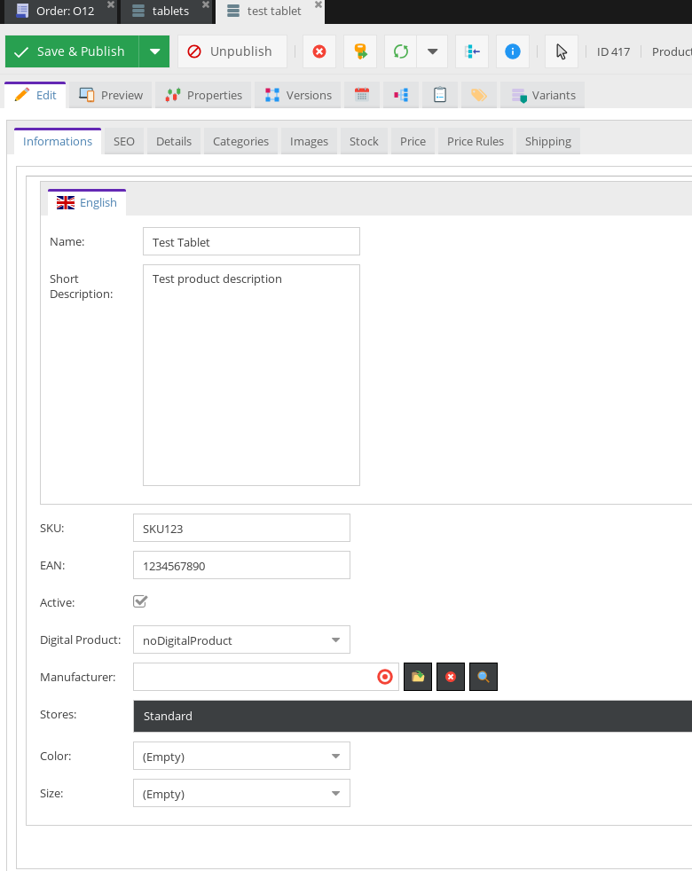
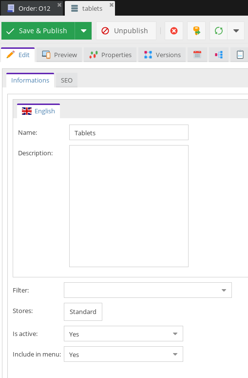
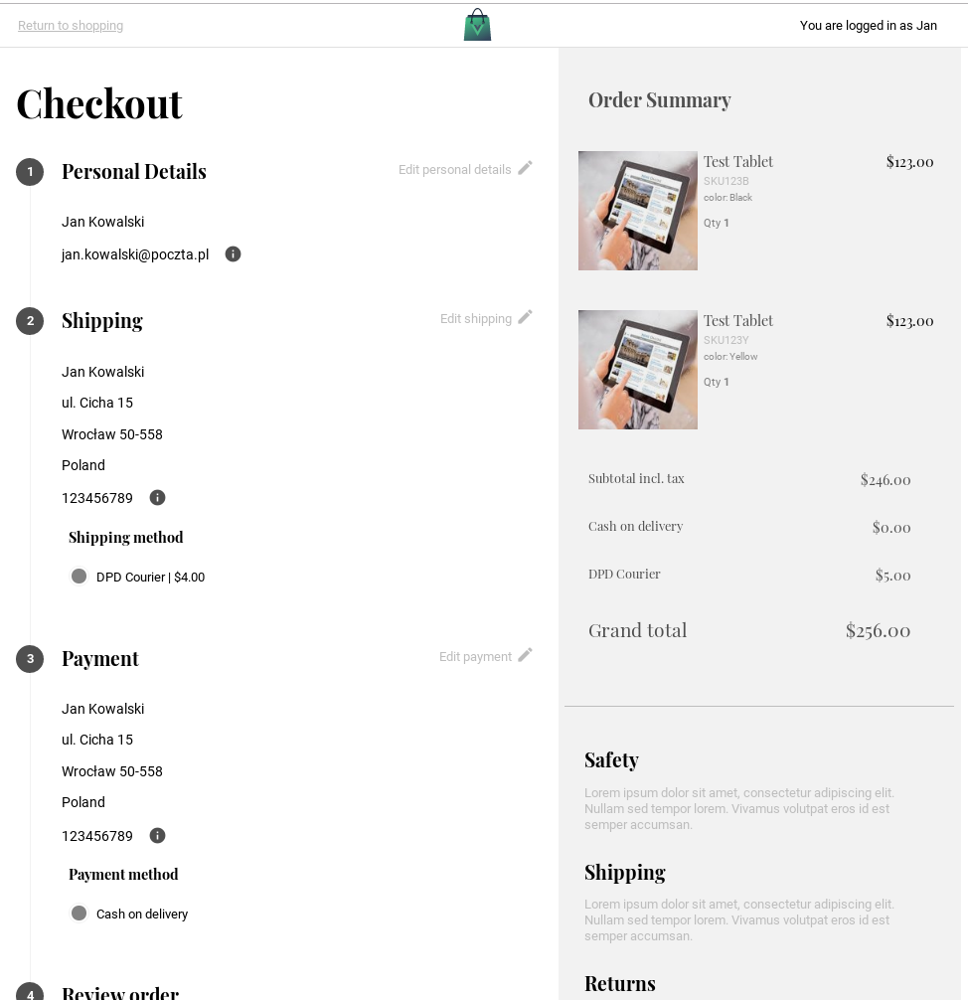

# First Progressive Web App for Pimcore and CoreShop
[](https://travis-ci.org/DivanteLtd/coreshop-vsbridge)


<a href="https://join.slack.com/t/vuestorefront/shared_invite/enQtMzA4MTM2NTE5NjM2LTI1M2RmOWIyOTk0MzFlMDU3YzJlYzcyYzNiNjUyZWJiMTZjZjc3MjRlYmE5ZWQ1YWRhNTQyM2ZjN2ZkMzZlNTg"></a>

This projects bring You the [Pimcore](https://pimcore.com) plus [Coreshop](http://www.coreshop.org/) support as a backend platform for [Vue Storefront - first Progressive Web App for e-Commerce](https://github.com/DivanteLtd/vue-storefront). 

Vue Storefront is a standalone PWA storefront for your eCommerce, possible to connect with any eCommerce backend (eg. Magento, Pimcore, Prestashop or Shopware) through the API.

 ## Video demo
 [](https://www.youtube.com/watch?v=L4K-mq9JoaQ)
Sign up for a demo at https://vuestorefront.io/ (Vue Storefront integrated with Pimcore OR Magento2).

# Pimcore data bridge
Vue Storefront is platform agnostic - which mean: it can be connected to virtually any eCommerce CMS. This project is a data connector for *CoreShop* and *Pimcore* data structures

The module is created as a Pimcore Symfony Bundle and provides the native data exchange capabilities of:
- pushing the entities marked as Products (maped in the Pimcore Admin panel) to Elastic Search (including support for configurable products),
- exposing all required dynamic API backends - like shopping cart, user accounts, totals etc.

# Setup and installation

The Data Bridge is provided as a Pimcore extension (Symfony Bundle)

## Requirements 
- php 7.1 or above
- pimcore/pimcore 5.4 or above
- coreshop/core-shop 2.0.x-dev
- vuestorefront and vuestorefront api containers must be visible for pimcore and vice versa


## Register bundles

In `app/AppKernel.php` of Your Pimcore instance please add this line to `registerBundlesToCollection`:
```
        if (class_exists('\ONGR\ElasticsearchBundle\ONGRElasticsearchBundle')) {
            $collection->addBundle(new ONGR\ElasticsearchBundle\ONGRElasticsearchBundle);
        }

        if (class_exists('\Cocur\Slugify\Bridge\Symfony\CocurSlugifyBundle')) {
            $collection->addBundle(new \Cocur\Slugify\Bridge\Symfony\CocurSlugifyBundle());
        }

        if (class_exists('\SymfonyBundles\JsonRequestBundle\SymfonyBundlesJsonRequestBundle')) {
            $collection->addBundle(new \SymfonyBundles\JsonRequestBundle\SymfonyBundlesJsonRequestBundle());
        }

        if (class_exists('\Lexik\Bundle\JWTAuthenticationBundle\LexikJWTAuthenticationBundle')) {
            $collection->addBundle(new \Lexik\Bundle\JWTAuthenticationBundle\LexikJWTAuthenticationBundle());
        }

        if (class_exists('\Gfreeau\Bundle\GetJWTBundle\GfreeauGetJWTBundle')) {
            $collection->addBundle(new \Gfreeau\Bundle\GetJWTBundle\GfreeauGetJWTBundle());
        }

        if (class_exists('\Nelmio\CorsBundle\NelmioCorsBundle')) {
            $collection->addBundle(new Nelmio\CorsBundle\NelmioCorsBundle());
        }
        
        if (class_exists('Gesdinet\JWTRefreshTokenBundle\GesdinetJWTRefreshTokenBundle')) {
            $collection->addBundle(new \Gesdinet\JWTRefreshTokenBundle\GesdinetJWTRefreshTokenBundle());
        }
```

## Configure ES connection
In `app/config/config.yml` of Your Pimcore instance add this ElasticSearch configuration:
```
ongr_elasticsearch:
    managers:
        default:
            index:
                index_name: vue_storefront_catalog
                hosts:
                    - es1:9200
            mappings:
                - CoreShop2VueStorefrontBundle
```

## Update database schema

Please execute the schema update
`php bin/console doctrine:schema:update --force`


## JWT Configuration
1. Inside root pimcore directory run these commands:
```
mkdir -p config/jwt
openssl genrsa -out config/jwt/private.pem -aes256 4096
openssl rsa -pubout -in config/jwt/private.pem -out config/jwt/public.pem
```

2. In the main config file - `app/config/config.yml` please do add the following section:
```
lexik_jwt_authentication:
    secret_key: '%kernel.project_dir%/config/jwt/private.pem'
    public_key: '%kernel.project_dir%/config/jwt/public.pem' 
    pass_phrase: 'enterYourPhrase' 
    token_ttl:  3600
    token_extractors:
        authorization_header:
            enabled: true
            prefix:  Bearer
            name:    Authorization

        query_parameter:
            enabled: true
            name: token
```

## Vue Storefront Configuration

After successfull Pimcore bundle installation Your Pimcore instance will be handling all the dynamic requests from Vue Storefront. Thereof You need to modify `vue-storefront/config/local.json` (assuming that Your Pimcore base URL is https://vuestorefrontcoreshop.localhost and ElasticSearch running on)

**Note**: As the Vue Storefront will be connecting to ElasticSearch from the client's browser You probably should put some kind of Proxy in front of ElasticSearch for scalability and security reasons. Please consider using the [vue-storefront-api](). It's endpoint [`/api/catalog`](https://github.com/DivanteLtd/vue-storefront-api/blob/master/src/api/catalog.js) works as a ElasticSearch HTTP(s) proxy. You can achieve the same results using nginx either Varnish.

```
  "elasticsearch": {
    "httpAuth": "",
    "host": "localhost:9200",
    "index": "vue_storefront_catalog",
    "min_score": 0.02,
    "csrTimeout": 5000,
    "ssrTimeout": 1000
  },
 "cart": {
    "create_endpoint": "http://vuestorefrontcoreshop.localhost/vsbridge/cart/create?token={{token}}",
    "updateitem_endpoint": "http://vuestorefrontcoreshop.localhost/vsbridge/cart/update?token={{token}}&cartId={{cartId}}",
    "deleteitem_endpoint": "http://vuestorefrontcoreshop.localhost/vsbridge/cart/delete?token={{token}}&cartId={{cartId}}",
    "pull_endpoint": "http://vuestorefrontcoreshop.localhost/vsbridge/cart/pull?token={{token}}&cartId={{cartId}}",
    "totals_endpoint": "http://localhost:8080/api/cart/totals?token={{token}}&cartId={{cartId}}",
    "paymentmethods_endpoint": "http://vuestorefrontcoreshop.localhost/vsbridge/cart/payment-methods?token={{token}}&cartId={{cartId}}",
    "shippingmethods_endpoint": "http://vuestorefrontcoreshop.localhost/vsbridge/cart/shipping-methods?token={{token}}&cartId={{cartId}}",
    "shippinginfo_endpoint": "http://vuestorefrontcoreshop.localhost/vsbridge/cart/shipping-information?token={{token}}&cartId={{cartId}}",
    "collecttotals_endpoint": "http://localhost:8080/api/cart/collect-totals?token={{token}}&cartId={{cartId}}",
    "deletecoupon_endpoint": "http://localhost:8080/api/cart/delete-coupon?token={{token}}&cartId={{cartId}}",
    "applycoupon_endpoint": "http://localhost:8080/api/cart/apply-coupon?token={{token}}&cartId={{cartId}}&coupon={{coupon}}"
  },
 "orders": {
    "endpoint": "http://vuestorefrontcoreshop.localhost/vsbridge/order?token={{token}}",
  },
  "users": {
    "endpoint": "http://vuestorefrontcoreshop.localhost/vsbridge/user",
    "history_endpoint": "http://vuestorefrontcoreshop.localhost/vsbridge/user/order-history?token={{token}}",
    "resetPassword_endpoint": "http://vuestorefrontcoreshop.localhost/vsbridge/user/reset-password",
    "changePassword_endpoint": "http://vuestorefrontcoreshop.localhost/vsbridge/user/change-password?token={{token}}",
    "login_endpoint": "http://vuestorefrontcoreshop.localhost/vsbridge/user/login",
    "create_endpoint": "http://vuestorefrontcoreshop.localhost/vsbridge/user/create",
    "me_endpoint": "http://vuestorefrontcoreshop.localhost/vsbridge/user/me?token={{token}}",
    "refresh_endpoint": "http://vuestorefrontcoreshop.localhost/vsbridge/user/refresh"
  },  
  "stock": {
    "endpoint": "http://vuestorefrontcoreshop.localhost/vsbridge/stock"
  },
  "images": {
    "baseUrl": "http://vuestorefrontcoreshop.localhost/img/",
    "productPlaceholder": "/assets/placeholder.jpg"
  },   
```


# Data formats and architecture
As Pimcore is a very extensible Framework, the data structures and format may vary. By default we do support official [CoreShop](http://coreshop.org) data structures.
For demonstration purposes we do support all the standard entities like:
- set of required attributes,
- categories,
- products: localized attributes, single photo (can be easily extendend), variants, prices.


# Screenshots

Please visit [Vue Storefront site](http://vuestorefront.io) to check out why it's so cool!


<br />This is the standard Pimcore panel where You can edit Your products, categories and assets.



Here is the order as it was transmited from Vue Storefront to CoreShop


All the products attributes, description, categories assets and other meta data is synchronized with Vue Storefront in real time



# Credits

This module has been initially created by Divante's team:
- Kamil Karkus - @kkarkus,
- Kamil Wręczycki - @kwreczycki

# Support

If You have any questions regarding this project feel free to contact us:
- [E-mail](mailto:contributors@vuestorefront.io),
- [Slack](http://slack.vuestorefront.io)

# Licence 
CoreShop VsBridge source code is completely free and released under the [MIT License](https://github.com/DivanteLtd/vue-storefront/blob/master/LICENSE).

